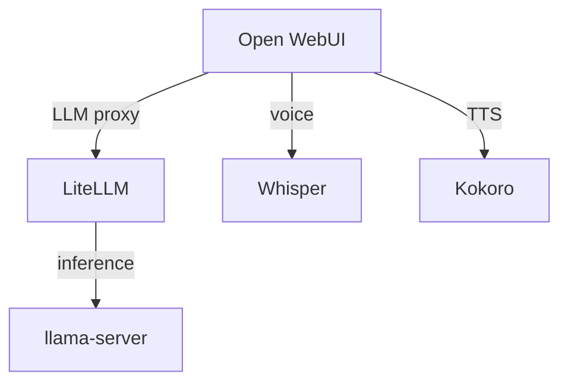

# Turnstone Orchestration

Turnstone is the multi-workstream AI orchestration platform on DreamHalo. It runs its own LLM agent loop with 19 built-in tools, 4 MCP server connections (Proxmox, Qdrant, SearXNG, Fetch), and a rich web UI that renders diagrams, tables, math, and interactive elements. Use it to dispatch autonomous tasks, run parallel investigations, generate visual reports, and monitor orchestration state.

---

## Connection

| Property | Value |
|----------|-------|
| Base URL | `http://turnstone:8080` |
| API version | `/v1/api/` |
| Auth | JWT via login or API token (`ts_` prefix) |
| SSE events | `/v1/api/events?ws_id=<id>` |
| Health | `/health` (no auth) |
| Container | `dream-turnstone` |
| Config | `/config/config.toml` + `/config/mcp.json` |
| Default model | `claude-sonnet-4-6` (via LiteLLM) |
| Web UI | `http://turnstone:8080/` |

---

## Authentication

Obtain a JWT before making API calls. Store the token for the session — don't re-login every call.

```bash
# Login and capture token
TOKEN=$(curl -sf http://turnstone:8080/v1/api/auth/login \
  -H 'Content-Type: application/json' \
  -d '{"username":"admin","password":"<password>"}' | python3 -c "import sys,json; print(json.load(sys.stdin)['token'])")

# Or use an API token directly (ts_ prefix)
TOKEN="ts_<token-hex>"

# All subsequent calls use this header
AUTH="-H 'Authorization: Bearer $TOKEN'"
```

If no admin user exists:
```bash
docker exec dream-turnstone turnstone-admin create-user --username admin --name Admin
```

---

## Workstreams

Workstreams are independent agent sessions with their own LLM context, tool state, memory, and message history. Up to **50 concurrent**. Each workstream runs autonomously once given a task.

### States

| State | Meaning | Action |
|-------|---------|--------|
| `IDLE` | Task complete, ready for new work | Read results, close, or send new task |
| `THINKING` | Agent is reasoning | Wait |
| `RUNNING` | Agent is executing a tool | Wait |
| `ATTENTION` | Agent needs approval | Call `/approve` (rare — skip_permissions is ON) |
| `ERROR` | Task failed | Check logs, retry or close |

### When to Use a Workstream

| Use Turnstone | Do it directly |
|---------------|----------------|
| Multi-step investigation needing web + infra + reasoning | Simple `mcporter call proxmox.get_nodes` |
| Parallel research across multiple topics | Single Proxmox operation |
| Autonomous audit that runs while you do other work | Quick health check via exec |
| Tasks needing web search + vector search combined | Simple curl or SSH command |
| Generating rich visual reports (diagrams, tables) | Answering a quick question |
| Long-running analysis that benefits from retry/memory | One-shot shell command |

---

## Built-in Tools (19)

These are Turnstone's native capabilities — available to every workstream.

### File & Search Tools

| Tool | Purpose | Auto-approved | Example |
|------|---------|---------------|---------|
| `read_file` | Read files from Turnstone's `/data` volume | Yes | `read_file path="/data/reports/audit.md"` |
| `write_file` | Write/create files on `/data` volume | Yes (skip_permissions ON) | `write_file path="/data/reports/new.md" content="# Report\n..."` |
| `edit_file` | Apply diffs to existing files | Yes | `edit_file path="/data/config.yaml" diff="..."` |
| `diff_file` | Show differences between files or versions | Yes | `diff_file path_a="/data/old.md" path_b="/data/new.md"` |
| `search` | Grep/ripgrep search across files | Yes | `search pattern="error" path="/data/logs/"` |

### Shell Execution

| Tool | Purpose | Auto-approved | Example |
|------|---------|---------------|---------|
| `bash` | **Execute arbitrary shell commands** inside the Turnstone container | Yes (skip_permissions ON) | `bash command="curl -sf http://litellm:4000/health"` |

The `bash` tool has full shell access within the Turnstone container. It can:
- Run `curl` to query any DreamHalo service
- Execute `python3` scripts for data processing
- Run system commands (`ls`, `cat`, `grep`, `ps`, `df`, etc.)
- Pipe and chain commands with `|`, `&&`, `;`
- Write scripts to `/data/` and execute them

**Examples:**
```
bash command="docker ps --format '{{.Names}} {{.Status}}'"   # Won't work — no docker socket
bash command="curl -sf http://litellm:4000/v1/models | python3 -m json.tool"
bash command="df -h /data && free -h"
bash command="python3 -c 'import json; print(json.dumps({\"hello\": \"world\"}, indent=2))'"
```

> **Note:** The container does NOT have a Docker socket mounted. For container management, use the Proxmox MCP tools or delegate to OpenClaw/MintOps.

### Web Tools

| Tool | Purpose | Auto-approved | Example |
|------|---------|---------------|---------|
| `web_fetch` | Fetch a URL and return its content (HTML→text) | Yes | `web_fetch url="https://docs.qdrant.tech/changelog/"` |
| `web_search` | Search the web via DuckDuckGo backend | Yes | `web_search query="ROCm 7 gfx1151 compatibility" max_results=5` |

### Agent & Planning Tools

| Tool | Purpose | Auto-approved | Example |
|------|---------|---------------|---------|
| `task` | Spawn an autonomous sub-agent within the workstream | Yes | `task description="Research Qdrant 1.17 changelog and summarize breaking changes"` |
| `plan` | Read-only planning agent — outlines steps without executing | Yes | `plan goal="Migrate from SQLite to PostgreSQL for n8n"` |

### Memory Tools

| Tool | Purpose | Auto-approved | Example |
|------|---------|---------------|---------|
| `memory` | Persistent typed memory — create, read, update, delete | Yes | `memory action="create" type="note" content="LXC 201 disk at 78%" tags=["infra"]` |
| `recall` | Search conversation history and past workstreams | Yes | `recall query="last infrastructure audit results"` |

### Utility Tools

| Tool | Purpose | Auto-approved | Example |
|------|---------|---------------|---------|
| `math` | Python sandbox for computation (safe eval) | Yes | `math expression="sum(range(1, 101))"` |
| `man` | Read documentation and man pages | Yes | `man topic="curl"` |
| `notify` | Send notifications (logs to workstream) | Yes | `notify message="Audit complete — 2 warnings found"` |
| `watch` | Monitor a file or URL for changes | Yes | `watch target="/data/metrics.json" interval=30` |
| `skill` | Invoke a Turnstone skill by name | Varies | `skill name="summarize" input="..."` |
| `read_resource` | Read MCP resources (URIs) | Yes | `read_resource uri="proxmox://nodes"` |
| `use_prompt` | Use MCP prompt templates | Yes | `use_prompt name="proxmox-health-check"` |

---

## MCP Servers & Tools (41 tools)

Turnstone sees MCP tools as `mcp__<server>__<tool>`. Four MCP servers are connected:

### Proxmox (`mcp__proxmox__*`) — 35 tools

Full Proxmox VE management — VMs, LXCs, snapshots, backups, storage, networking, and command execution.

**Node & Cluster:**
| Tool | Purpose | Example use |
|------|---------|-------------|
| `get_nodes` | List all Proxmox nodes with status | "Show me cluster health" |
| `get_node_status` | CPU, RAM, uptime for a specific node | "How much RAM is free on pve?" |
| `get_node_networks` | Network interfaces on a node | "What networks does pve have?" |
| `get_node_dns` | DNS config for a node | "Check DNS settings" |
| `get_node_syslog` | System logs from a node | "Show recent syslog entries" |
| `get_node_tasks` | Recent tasks (backups, migrations, etc.) | "What tasks ran today?" |

**VM & LXC Lifecycle:**
| Tool | Purpose | Example use |
|------|---------|-------------|
| `list_vms` | List all VMs on a node | "List all VMs" |
| `list_lxc` | List all LXC containers on a node | "List all containers" |
| `get_vm_status` | Detailed status of a VM | "Status of VM 100" |
| `get_lxc_status` | Detailed status of an LXC | "Status of LXC 201" |
| `get_vm_config` | Full config of a VM | "Show VM 100 config" |
| `get_lxc_config` | Full config of an LXC | "Show LXC 201 config" |
| `start_vm` | Start a VM | "Start VM 100" |
| `stop_vm` | Stop a VM | "Stop VM 100" |
| `start_lxc` | Start an LXC container | "Start LXC 201" |
| `stop_lxc` | Stop an LXC container | "Stop LXC 201" |
| `create_lxc` | Create a new LXC container | "Create an Ubuntu LXC" |
| `resize_lxc` | Resize disk/RAM/CPU of an LXC | "Give LXC 201 more RAM" |

**Snapshots & Backups:**
| Tool | Purpose | Example use |
|------|---------|-------------|
| `list_snapshots` | List snapshots for a VM/LXC | "Show snapshots for LXC 201" |
| `create_snapshot` | Create a snapshot | "Snapshot LXC 201 before upgrade" |
| `delete_snapshot` | Delete a snapshot | "Delete old snapshot" |
| `rollback_snapshot` | Rollback to a snapshot | "Rollback LXC 201 to pre-upgrade" |
| `list_backups` | List backups in storage | "Show all backups" |

**Storage:**
| Tool | Purpose | Example use |
|------|---------|-------------|
| `get_storage` | List storage pools | "Show storage pools" |
| `get_storage_content` | List content in a storage pool | "What's in local-lvm?" |
| `list_isos` | List available ISO images | "Show available ISOs" |
| `upload_iso` | Upload an ISO from URL | "Download Ubuntu ISO" |

**Exec & Networking:**
| Tool | Purpose | Example use |
|------|---------|-------------|
| `exec_command` | **Execute a command inside a VM/LXC** | "Run `df -h` inside LXC 201" |
| `get_vm_interfaces` | Network interfaces of a VM | "What IPs does VM 100 have?" |
| `get_lxc_interfaces` | Network interfaces of an LXC | "What IP is LXC 201 on?" |

**Firewall:**
| Tool | Purpose | Example use |
|------|---------|-------------|
| `get_firewall_rules` | List firewall rules | "Show firewall rules for LXC 201" |
| `create_firewall_rule` | Add a firewall rule | "Allow port 8080 on LXC 201" |
| `delete_firewall_rule` | Remove a firewall rule | "Remove rule #3" |

**Cluster:**
| Tool | Purpose | Example use |
|------|---------|-------------|
| `get_cluster_status` | Cluster-wide status | "Is the cluster healthy?" |
| `get_cluster_resources` | All resources across cluster | "Show all resources" |

### Qdrant (`mcp__qdrant__*`) — 4 tools

Vector database operations — semantic search, collection management.

| Tool | Purpose | Example use |
|------|---------|-------------|
| `list_collections` | Enumerate all vector collections | "What collections exist in Qdrant?" |
| `collection_info` | Size, status, vector dimensions | "How big is the `memory` collection?" |
| `semantic_search` | Natural language search (auto-embeds via LiteLLM) | "Search for 'deployment failures' in memory" |
| `scroll_collection` | Browse points without a query vector | "Show me the first 10 points in `logs`" |

### SearXNG (`mcp__searxng__*`) — 2 tools

Web and news search via the local SearXNG instance.

| Tool | Purpose | Example use |
|------|---------|-------------|
| `web_search` | General web search with category/language filtering | "Search for AMD ROCm 7 release notes" |
| `news_search` | Recent news articles | "Latest news about Proxmox 9" |

### Fetch (`mcp__fetch__*`) — built-in URL fetcher

| Tool | Purpose | Example use |
|------|---------|-------------|
| `fetch` | Fetch any URL and return content | "Fetch https://github.com/qdrant/qdrant/releases" |

---

## Rich UI & Element Generation

Turnstone's web UI renders rich content produced by agents. **Always prefer designed elements when output would benefit from visual structure.** The UI supports:

### Mermaid Diagrams

Agents can produce architecture diagrams, flowcharts, sequence diagrams, Gantt charts, and more using fenced mermaid blocks. The web UI renders them automatically.

````

````

**When to use:** Architecture overviews, dependency maps, workflow visualizations, deployment diagrams, state machines, sequence diagrams for API flows.

**Supported diagram types:** `graph`, `flowchart`, `sequenceDiagram`, `classDiagram`, `stateDiagram`, `erDiagram`, `gantt`, `pie`, `gitgraph`, `mindmap`, `timeline`, `sankey`, `quadrantChart`, `xychart`.

### Tables

Standard markdown tables render with horizontal scrolling and proper styling.

```
| Service | Port | Status | Layer |
|---------|------|--------|-------|
| LiteLLM | 4000 | healthy | middleware |
| Qdrant | 6333 | healthy | core |
```

**When to use:** Service inventories, comparison matrices, audit results, resource usage summaries, configuration listings.

### Collapsible Sections

Use `<details>` blocks for long output that should be scannable:

```html
<details>
<summary>Full node status output (click to expand)</summary>

...detailed content here...

</details>
```

**When to use:** Verbose command output, full config dumps, long log excerpts, raw API responses.

### Math (KaTeX)

Inline math with `$...$` and display math with `$$...$$`:

```
The memory usage is $\frac{used}{total} \times 100\%$

$$\text{IOPS} = \frac{\text{IO operations}}{\text{seconds}}$$
```

**When to use:** Resource calculations, performance formulas, capacity planning math.

### Code Blocks

Syntax-highlighted code blocks with language detection:

````
```python
import json
data = {"status": "healthy", "uptime": 99.7}
print(json.dumps(data, indent=2))
```
````

**When to use:** Config snippets, script examples, API responses, command output.

### Images

Click-to-load image placeholders (security: only loads on user click):

```

```

### Combining Elements

For best results, instruct Turnstone agents to combine elements. Example task:

> "Audit the DreamHalo infrastructure. Present findings as: a mermaid architecture diagram showing service dependencies, a table of all services with their status and resource usage, and collapsible details sections for any warnings or issues found."

---

## API Reference

### Workstream Management

```bash
# List all workstreams
curl -sf $AUTH http://turnstone:8080/v1/api/workstreams

# Create a new workstream
curl -sf $AUTH http://turnstone:8080/v1/api/workstreams/new \
  -H 'Content-Type: application/json' \
  -d '{"name": "infra-audit"}'

# Close a workstream (keeps history)
curl -sf $AUTH http://turnstone:8080/v1/api/workstreams/close \
  -H 'Content-Type: application/json' \
  -d '{"ws_id": "<id>"}'

# Delete a workstream (permanent)
curl -sf $AUTH http://turnstone:8080/v1/api/workstreams/<id>/delete -X POST

# Reopen a closed workstream
curl -sf $AUTH http://turnstone:8080/v1/api/workstreams/<id>/open -X POST
```

### Sending Messages

```bash
# Send a task (starts the agent working)
curl -sf $AUTH http://turnstone:8080/v1/api/send \
  -H 'Content-Type: application/json' \
  -d '{"ws_id": "<id>", "message": "Run a full infrastructure audit"}'

# Send a slash command
curl -sf $AUTH http://turnstone:8080/v1/api/command \
  -H 'Content-Type: application/json' \
  -d '{"ws_id": "<id>", "command": "/ws list"}'

# Approve a pending tool call (rare — skip_permissions is ON)
curl -sf $AUTH http://turnstone:8080/v1/api/approve \
  -H 'Content-Type: application/json' \
  -d '{"ws_id": "<id>", "approve": true}'

# Cancel current operation
curl -sf $AUTH http://turnstone:8080/v1/api/cancel \
  -H 'Content-Type: application/json' \
  -d '{"ws_id": "<id>"}'
```

### Streaming Events (SSE)

```bash
# Stream events from a specific workstream
curl -sf $AUTH -N http://turnstone:8080/v1/api/events?ws_id=<id>

# Stream all workstream events globally
curl -sf $AUTH -N http://turnstone:8080/v1/api/events/global
```

**SSE event types:** `connected`, `history`, `thinking_start`, `thinking_stop`, `reasoning`, `content`, `stream_end`, `tool_info`, `approve_request`, `tool_output_chunk`, `tool_result`, `status`.

### Memory API

```bash
# List all memories
curl -sf $AUTH http://turnstone:8080/v1/api/memories

# Search memories by keyword
curl -sf $AUTH "http://turnstone:8080/v1/api/memories/search?q=<query>"

# Create a memory
curl -sf $AUTH http://turnstone:8080/v1/api/memories \
  -H 'Content-Type: application/json' \
  -d '{"type": "note", "content": "LXC 201 disk at 78%", "tags": ["infra", "warning"]}'

# Delete a memory
curl -sf $AUTH -X DELETE http://turnstone:8080/v1/api/memories/<id>
```

### Skills & Admin

```bash
# List available Turnstone skills
curl -sf $AUTH http://turnstone:8080/v1/api/skills

# Health check (no auth)
curl -sf http://turnstone:8080/health
```

---

## Patterns & Recipes

### Pattern 1: Fire-and-Forget Research

Dispatch a task and check back later:

```bash
WS=$(curl -sf $AUTH http://turnstone:8080/v1/api/workstreams/new \
  -H 'Content-Type: application/json' \
  -d '{"name": "rocm-research"}' | python3 -c "import sys,json; print(json.load(sys.stdin)['ws_id'])")

curl -sf $AUTH http://turnstone:8080/v1/api/send \
  -H 'Content-Type: application/json' \
  -d "{\"ws_id\": \"$WS\", \"message\": \"Research the current state of ROCm 7 support for gfx1151 (Strix Halo). Check official AMD docs, GitHub issues, and community forums. Present findings as a summary table with links, and a mermaid timeline of ROCm release milestones.\"}"

# Check later
curl -sf $AUTH http://turnstone:8080/v1/api/workstreams | python3 -c "
import sys, json
for ws in json.load(sys.stdin):
    print(f\"{ws['name']}: {ws['state']}\")
"
```

### Pattern 2: Parallel Investigations

Spawn multiple workstreams for concurrent research:

```bash
for topic in "Qdrant 1.17 changelog" "LiteLLM proxy security" "n8n MCP integration"; do
  WS=$(curl -sf $AUTH http://turnstone:8080/v1/api/workstreams/new \
    -H 'Content-Type: application/json' \
    -d "{\"name\": \"research-$(echo $topic | tr ' ' '-' | head -c 30)\"}" | python3 -c "import sys,json; print(json.load(sys.stdin)['ws_id'])")
  curl -sf $AUTH http://turnstone:8080/v1/api/send \
    -H 'Content-Type: application/json' \
    -d "{\"ws_id\": \"$WS\", \"message\": \"Research: $topic. Summarize key findings with a table of changes/issues and any action items for a homelab running DreamHalo.\"}"
done
```

### Pattern 3: Infrastructure Audit with Visual Report

```bash
curl -sf $AUTH http://turnstone:8080/v1/api/send \
  -H 'Content-Type: application/json' \
  -d "{\"ws_id\": \"$WS\", \"message\": \"Run a full DreamHalo infrastructure audit:
1. Get Proxmox node status and resource usage via MCP
2. List all LXC containers with states and resource allocation
3. Check storage pools for capacity warnings
4. Search the web for any CVEs affecting our stack (Proxmox 8, Qdrant, n8n, LiteLLM)

Present your findings as:
- A mermaid architecture diagram showing the infrastructure layout
- A status table for all services (name, port, status, CPU%, RAM%)
- A risk table for any CVEs or warnings found
- Collapsible details sections for raw data
\"}"
```

### Pattern 4: Vector Search + Web Context

Combine Qdrant semantic search with web research:

```bash
curl -sf $AUTH http://turnstone:8080/v1/api/send \
  -H 'Content-Type: application/json' \
  -d "{\"ws_id\": \"$WS\", \"message\": \"Search the Qdrant memory collection for 'deployment failures' and 'service outages'. Then search the web for any known issues with the versions we're running. Cross-reference and present a timeline of incidents using a mermaid timeline diagram.\"}"
```

### Pattern 5: Proxmox Operations with Reasoning

Delegate complex infrastructure tasks:

```bash
curl -sf $AUTH http://turnstone:8080/v1/api/send \
  -H 'Content-Type: application/json' \
  -d "{\"ws_id\": \"$WS\", \"message\": \"Check Proxmox cluster health:
1. Get node status (CPU, RAM, uptime)
2. List all containers and VMs with their states
3. Check disk usage on each storage pool
4. Run 'df -h' inside LXC 201 via exec_command
5. If anything looks concerning, explain why and suggest remediation

Use a mermaid pie chart for storage distribution and a table for container status.\"}"
```

### Pattern 6: SSE Monitoring

Stream workstream progress in real-time:

```bash
# Background stream to log file
curl -sf $AUTH -N http://turnstone:8080/v1/api/events?ws_id=$WS > /tmp/ts-stream.log &
STREAM_PID=$!

# Send the task
curl -sf $AUTH http://turnstone:8080/v1/api/send \
  -H 'Content-Type: application/json' \
  -d "{\"ws_id\": \"$WS\", \"message\": \"Run a comprehensive service health check\"}"

# Check progress
sleep 10 && tail -20 /tmp/ts-stream.log

# Clean up
kill $STREAM_PID 2>/dev/null
```

---

## Rules

1. **Always authenticate first.** Store the token for the session — don't re-login every call.
2. **Name workstreams descriptively.** Use kebab-case: `disk-audit-lxc201`, `rocm-upgrade-research`, `weekly-security-scan`.
3. **Close workstreams when done.** Max 50 concurrent. Don't leave idle workstreams accumulating.
4. **skip_permissions is ON.** All tool calls auto-approve in this deployment. No need to call `/approve`.
5. **Prefer workstreams for autonomous work.** Turnstone retries, has memory, and coordinates multiple tools — better than a long bash pipeline for complex tasks.
6. **Don't duplicate direct tools.** If you can do it with a simple `mcporter call` or `exec`, don't spin up a Turnstone workstream. Turnstone is for delegation and multi-step reasoning, not proxying single commands.
7. **Check workstream state before reading.** IDLE = done, THINKING/RUNNING = working, ATTENTION = needs input, ERROR = failed.
8. **Turnstone has its own memory.** It persists across workstreams. Use it for Turnstone-scoped knowledge — don't sync with OpenClaw memory.
9. **Models route through LiteLLM.** Default is `claude-sonnet-4-6` but all DreamHalo models are available (Claude, Qwen, GLM, Nemotron, Devstral, Kappa, local).
10. **Prefer rich UI elements.** When asking Turnstone for reports or audits, request mermaid diagrams, tables, and collapsible sections. The web UI renders them natively — always prefer a designed component over plain text when the output benefits from visual structure.
11. **Shell via bash tool is container-scoped.** The `bash` tool runs inside the Turnstone container. It has network access to all DreamHalo services but no Docker socket. For container management, use Proxmox MCP.
12. **Fetch vs web_search:** Use `web_fetch`/`mcp__fetch__fetch` for known URLs. Use `web_search`/`mcp__searxng__web_search` for discovery.

---

## Troubleshooting

| Problem | Fix |
|---------|-----|
| Connection refused | `docker ps \| grep turnstone` — check if container is running |
| 401 Unauthorized | Re-authenticate — JWT may have expired |
| Workstream stuck in THINKING | `POST /v1/api/cancel` then check container logs |
| MCP tools not available | `docker exec dream-turnstone turnstone --mcp-config /config/mcp.json --list-tools` |
| 406 on /mcp endpoints | Normal — MCP uses POST, not GET. Use `/health` for checks. |
| Workstream limit hit | Close idle workstreams: list → close any with state IDLE |
| Model errors | Check LiteLLM is healthy: `curl -sf http://litellm:4000/health` |

---

## Output Format

When reporting Turnstone operations to the user:
- State the workstream name and what it was tasked with
- Report the current state (running / complete / error)
- If complete, summarize the findings concisely
- If the workstream produced diagrams or tables, mention they're viewable in the Turnstone web UI
- If error, include the relevant log snippet
- Always include the workstream ID for follow-up
